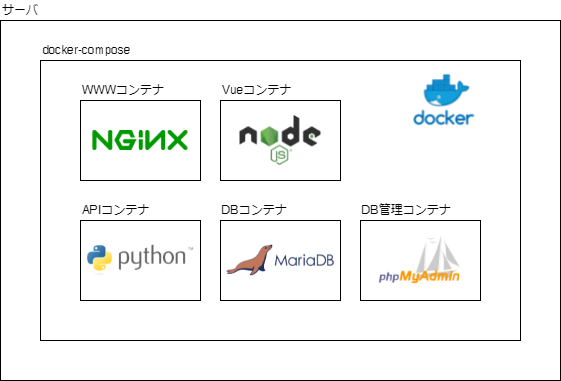

# 神野研究室（TCU） 公式ポータルサイト

仮の構成図

VueもAPIもnginxを経由します。

## ロードマップ（策定中）

- [x] 基本構成の作成
- [x] 外観作成
- [x] データベース連携
- [x] TCUアカウント連携
- [x] 研究室名簿
- [ ] メールアドレス認証
- [ ] TCUポータル表示
- [ ] TCUメール送受信
- [ ] LMS表示
- [ ] 時間割
- [ ] 学食メニュー
- [ ] スケジュール表示
- [ ] サーバリアルタイム情報
- [ ] 出席報告
- [ ] 全学名簿
- [ ] Slack通知
- [ ] フォーム
- [ ] 写真アルバム
- [ ] ファイルストレージ
- [ ] 権限管理
- [ ] ゲストモード